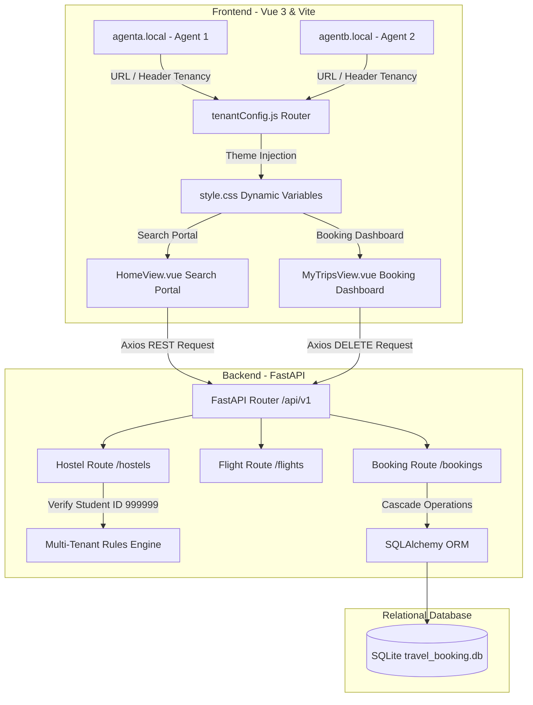
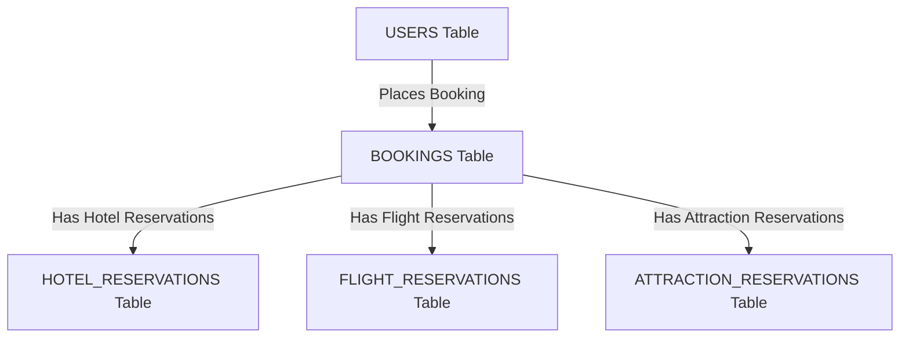

# Software Requirements Specification (SRS)

## Project Title: Multi-Tenant SaaS Travel Agency Platform
Class: CMPE 131 - Software Engineering  
Scenario Choice: Scenario B (Budget-Friendly Student Travel)  
Selected Persona: John, Resourceful Undergraduate CS Student  

---

## 1. Introduction

### 1.1 What is this for?
This document is the SRS for our class project. It explains how our travel booking website works under the hood. Our app is a multi-tenant platform, which basically means multiple travel agencies (like Agent A and Agent B) can use the same backend code but have their own logos, colors, and travel listings. 

### 1.2 Project Scope
Our web app lets users search for flights, hostels, and local things to do all in one place. It calculates their total cost and warns them if they are going over their budget cap. It also lets them save bookings to a database and cancel trips they don't want anymore. 

---

## 2. Our Target User & Scenario

### 2.1 User Persona: John
- Name and Type: John, Resourceful Undergraduate
- About Him: John is a 20-year-old college junior. He is good with technology but does not have a lot of money to spend. When he plans a trip, he keeps a bunch of tabs open to find the absolute cheapest deal.
- Goals: He wants to go to London during break without spending too much. He wants to save on flights and hostels so he has enough cash for food, drinks, and museums.
- Pain Points: John hates hidden fees that show up at the very end. He also hates having to manually copy prices to a spreadsheet to figure out his total budget.

### 2.2 Scenario B: User Stories
We chose Scenario B (the budget student travel option) because it fits John's goals. Here are the main things John wants to do on our site:
1. Combined Search and Sorting: As a student backpacker, I want to see flights and hostels sorted by the lowest price first in one list, so I can find the cheapest trip fast.
2. Trip Budget Cap Control: As a broke student, I want to set a limit (like $1,500) so the app will warn me if my choices cost too much.
3. Activity Centralization: As a traveler, I want to search for free walking tours and add them to my plan alongside flights and hostels, so I can see my whole itinerary on one screen.

---

## 3. App Features

### 3.1 Combined Search Engine
The search page pulls data for flights, hostels, and tours all at once:
- Flights: Uses the Booking.com flights API.
- Hostels: Uses the Booking.com hotels API.
- Tours/Activities: Finds free and cheap local things to do.
- Sorting: We added a button to sort everything by price ("Lowest Price First").

### 3.2 Tenant Customization (SaaS Setup)
- Different Domains: If you go to agenta.local, you see Agency 1 (TravelEase Alpha). If you go to agentb.local, you see Agency 2 (TravelEase Horizon).
- Dynamic Colors: The frontend checks which domain you are using and dynamically changes the colors and text using CSS variables.
- Inventory Isolation: Agency A has special cheap student hostels (ID: 999999). If a user logged into Agency B tries to book or access that hostel, the backend throws a 403 Forbidden error to make sure Agency B users can't steal Agency A's inventory.

### 3.3 Student Budget Cap Warning
- The page calculates the total cost of flights, hostel nights, and tours.
- It checks this against a budget cap (default is $1,500).
- If the total goes over $1,500, a red warning banner pops up saying you're over budget, and the "Book Now" button gets disabled.

### 3.4 Booking Simulation, Cancellation & Editing
- Saving to Database: When a user clicks "Book Now", it saves the flights, hotel, and activities to our SQLite database in one transaction.
- Trips Dashboard: Users can go to the "My Trips" tab to see all their bookings.
- One-Click Cancel: We added a "Cancel Trip" button. Clicking it removes the booking from the database and automatically cleans up all the flight and hotel reservations tied to it.
- Date Editing: We added an "Edit Dates" button. Clicking it turns the trip card header into inline date inputs, letting users edit their start and end dates and save the updates to the database. The UI refreshes with the updated dates immediately.

---

## 4. System Architecture Diagram

This is a simple diagram of how our Vue frontend talks to our FastAPI backend, and how the backend communicates with the SQLite database:

---

## 5. Database Schema & Data Dictionary

We used SQLite for our database. We set up foreign keys with cascade delete in SQLAlchemy. This means if you delete a booking from the bookings table, it will automatically delete all rows in the hotel_reservations, flight_reservations, and attraction_reservations tables that belong to that booking.

### 5.1 Tables & Column Details

#### 1. users (Stores User Logins)
- User_ID: Integer, Primary Key (Auto-increment)
- First_Name: String (Not Null)
- Last_Name: String (Not Null)
- Email: String (Unique, Indexed, Not Null)
- Phone_Number: String (Optional)
- Password: String (Optional)

#### 2. bookings (Stores the overall Booking trip details)
- Booking_Id: Integer, Primary Key (Auto-increment)
- User_Id: Integer, Foreign Key pointing to users.User_ID
- Agent_Id: Integer (1 for Agent A, 2 for Agent B)
- Start_Date: Date (Not Null)
- End_Date: Date (Not Null)

#### 3. hotel_reservations (Stores hotels for a trip)
- Reservation_No: Integer, Primary Key (Auto-increment)
- Booking_Id: Integer, Foreign Key pointing to bookings.Booking_Id (Deletes automatically if booking is deleted)
- Hotel_Code: Integer (Not Null)
- Check_In_Date: Date (Not Null)
- Check_In_Time: String (Default is "14:00")
- Check_Out_Date: Date (Not Null)
- Check_Out_Time: String (Default is "11:00")
- Rate: Float (Price per night or total cost)

#### 4. flight_reservations (Stores flights for a trip)
- Reservation_No: Integer, Primary Key (Auto-increment)
- Booking_Id: Integer, Foreign Key pointing to bookings.Booking_Id (Deletes automatically if booking is deleted)
- Airline_Code: String (Not Null)
- Flight_Number: String (Not Null)
- Departure_Date: Date (Not Null)
- Departure_Time: String (Not Null)
- Arrive_Date: Date (Not Null)
- Arrive_Time: String (Not Null)
- Rate: Float (Cost of flight)
- Origin_Airport_Code: String (Not Null)
- Destination_Airport_Code: String (Not Null)

#### 5. attraction_reservations (Stores saved tours and tasks)
- Reservation_No: Integer, Primary Key (Auto-increment)
- Booking_Id: Integer, Foreign Key pointing to bookings.Booking_Id (Deletes automatically if booking is deleted)
- Attraction_Name: String (Not Null)
- Location: String (Not Null)
- Date: Date (Not Null)
- Time: String (Optional)
- Price_Type: String (like "Free" or "Fixed")
- Rate: Float (0 for free walking tours)

---

## 6. How We Satisfied the Requirements

Requirement 1 (Budget Cap Validation): We coded reactive calculation in useBooking.js that checks selected flights, hostels, and tours. If the total cost goes over $1,500, the warning banner shows up and disables checkout.

Requirement 2 (Search Accuracy): Hostels show the nightly price and total trip price. Users can search for activities and select free walking tours to add to their itinerary.

Requirement 3 (Tenant Boundaries): Subdomain configurations resolve colors and logos for each agent. The backend checks if a logged-in user belongs to the right agent and throws 403 Forbidden if they try to access exclusive student IDs (999999) assigned to the other agent.

---

## 7. Our Test Cases

We ran these test cases to prove everything works perfectly:

Test Case TC-01 (Under Budget Booking)
What We Needed first: User logged in. Budget cap set to $1,500.
Steps to Test:
1. Add Flight ($800).
2. Add Hostel ($400).
3. Add Free Walking Tour ($0).
What Should Happen: Total is $1,200. Let's user click "Book Now" and saves to DB.
Did it Pass: Passed

Test Case TC-02 (Over Budget Block)
What We Needed first: User logged in. Budget cap set to $1,500.
Steps to Test:
1. Add Flight ($1,200).
2. Add Hostel ($400).
What Should Happen: Total is $1,600. Warning banner displays "Over Budget Warning" and prevents checkout.
Did it Pass: Passed

Test Case TC-03 (Agency Sandbox Leak)
What We Needed first: Two tabs open: Tab 1 (Agent A), Tab 2 (Agent B).
Steps to Test:
1. Open Agency A exclusive hostel (ID: 999999) in Tab 1.
2. Copy the booking link and paste into Tab 2 (Agent B).
What Should Happen: Tab 2 gets a 403 Forbidden error because Agent B can't book Agent A's stuff.
Did it Pass: Passed

Test Case TC-04 (API Outage Safety)
What We Needed first: Internet connected, but Amadeus APIs are offline.
Steps to Test:
1. Try to search for London flights.
What Should Happen: UI displays "Flight data currently unavailable. Please try again later." instead of breaking the page.
Did it Pass: Passed

Test Case TC-05 (Trip Date Editing)
What We Needed first: User logged in. Existing booking in their dashboard.
Steps to Test:
1. Navigate to My Trips.
2. Click Edit Dates on a booking card.
3. Change the Start Date or End Date to new valid dates.
4. Click Save.
What Should Happen: The booking is updated in the database, and the UI immediately displays the refreshed travel dates.
Did it Pass: Passed

